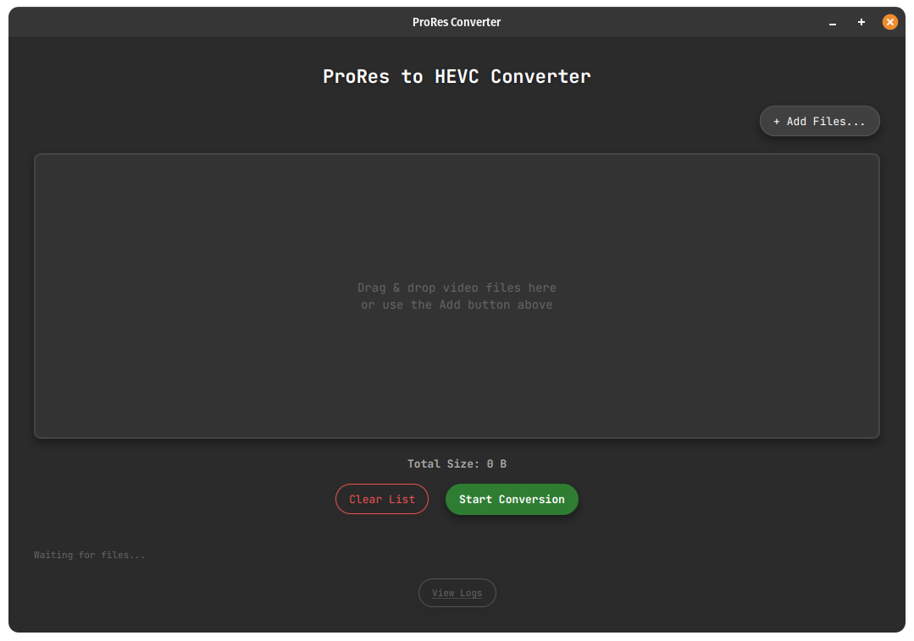
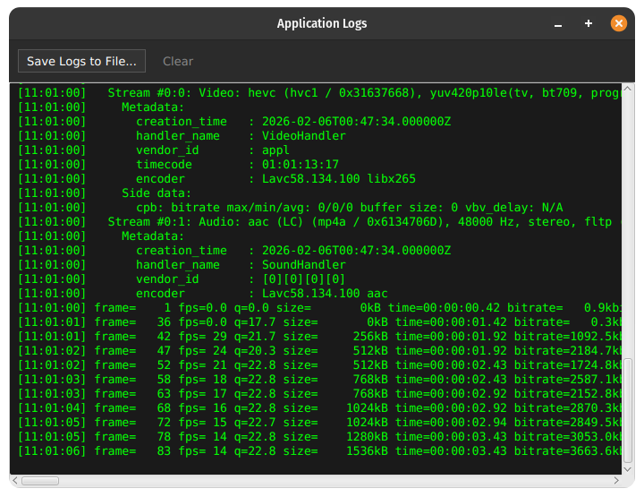

# ProRes to HEVC Converter (Linux)


A robust, modern video converter built specifically for Linux content creators. This application provides a clean **JavaFX** interface over **FFmpeg** to batch convert heavy **ProRes** footage into high-efficiency **HEVC (H.265)** files, saving disk space without compromising visual quality.

## 🚀 Key Features

* **High Efficiency:** Converts Apple ProRes 422/HQ/LT to H.265 (HEVC) Main 10.
* **Batch Processing:** Drag & drop multiple files; queue management.
* **Smart State Management:** Seamlessly handle multiple conversion cycles.
* **Tech-First UI:** "Hacker-style" real-time log window for FFmpeg output monitoring.
* **Native Integration:** System tray icon and desktop menu integration (Linux).
* **Performance:** Uses `libx265` with optimized presets (CRF 18 / Slow) for maximum quality retention.

## 📸 Screenshots




*The modern dark mode interface featuring drag-and-drop queue and real-time FFmpeg log monitoring.*

## 🛠️ Tech Stack

* **Language:** Java 21 (OpenJDK)
* **Framework:** JavaFX 21 (Modular)
* **Build Tool:** Maven (Wrapper included)
* **Core Engine:** FFmpeg (ProcessBuilder integration)
* **Architecture:** MVC with Service Layer separation and background Concurrency Tasks.

## 📦 Prerequisites

Ensure you have the following installed on your Linux machine:

1.  **Java 21 JDK** (Recommended via SDKMAN):
    ````bash
    sdk install java 21.0.2-tem
    ````

2.  **FFmpeg:**
    ````bash
    sudo apt install ffmpeg
    ````

## ⚡ Installation & Usage

This project includes a **Makefile** to automate the build and installation process, handling dependencies and system shortcuts automatically.

### Option 1: Quick Install (Recommended)
This will compile the project, create the executable, and add a shortcut to your Application Menu.

````bash
make install
````
*After installation, simply search for "ProRes Converter" in your system launcher.*

### Option 2: Run from Source (Dev Mode)
To run the application directly without installing:

````bash
make run
````

### Option 3: Uninstall
To remove the application and the desktop shortcut cleanly:

````bash
make uninstall
````

## 📂 Project Structure

````text
├── src/
│   ├── main/
│   │   ├── java/com/videoconverter/  # Application Logic (MVC)
│   │   └── resources/                # FXML Views, CSS, and Icons
├── Makefile                          # Installation Automation
├── mvnw                              # Maven Wrapper (Linux/Mac)
├── mvnw.cmd                          # Maven Wrapper (Windows)
└── pom.xml                           # Maven Configuration
````

## 🤝 Contributing

1.  Fork the project
2.  Create your feature branch:
    ````bash
    git checkout -b feature/AmazingFeature
    ````
3.  Commit your changes:
    ````bash
    git commit -m 'Add some AmazingFeature'
    ````
4.  Push to the branch:
    ````bash
    git push origin feature/AmazingFeature
    ````
5.  Open a Pull Request

## 📝 License

Distributed under the MIT License. See `LICENSE` for more information.
